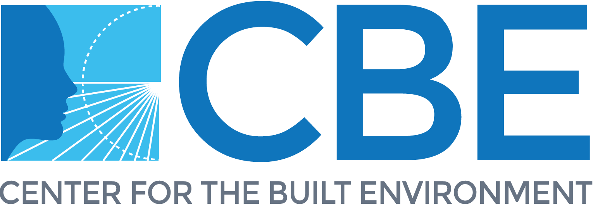

<!-- PROJECT LOGO -->
<br />
<div align="center">

<a href="https://github.com/CenterForTheBuiltEnvironment/comfort-dash/assets/img/CBE-logo-2018.png">
    
</a>
&nbsp;&nbsp;&nbsp;&nbsp;&nbsp; &nbsp;&nbsp;&nbsp;&nbsp;&nbsp;
<a href="https://github.com/CenterForTheBuiltEnvironment/comfort-dash/assets/img/tum-blue.png">
    
</a>

<h3 align="center">BEAT: Building Experiment Assistant Toolkit</h3>

  <p align="center">
    <br />
    <a href="https://github.com/CenterForTheBuiltEnvironment/cbe-tool-template"><strong>Explore the docs »</strong></a>
    <br />
    <br />
    <a href="<!-- Insert link here -->">View Demo</a>
    ·
    <a href="<!-- Insert link here -->">Report Bug</a>
    ·
    <a href="<!-- Insert link here -->">Request Feature</a>
  </p>
</div>


<!-- TABLE OF CONTENTS -->
<details>
  <summary>Table of Contents</summary>
  <ol>
    <li>
      <a href="#about-the-project">About The Project</a>
      <ul>
        <li><a href="#built-with">Built With</a></li>
      </ul>
    </li>
    <li>
      <a href="#getting-started">Getting Started</a>
      <ul>
        <li><a href="#prerequisites">Prerequisites</a></li>
        <li><a href="#installation">Installation</a></li>
      </ul>
    </li>
    <li><a href="#usage">Usage</a></li>
    <li><a href="#roadmap">Roadmap</a></li>
    <li><a href="#contributing">Contributing</a></li>
    <li><a href="#license">License</a></li>
    <li><a href="#contact">Contact</a></li>
    <li><a href="#acknowledgments">Acknowledgments</a></li>
  </ol>
</details>


<!-- ABOUT THE PROJECT -->
## About The Project

This is the official repository for BEAT, a tool supporting the design and execution of thermo-physiological experiments in the built environment. We found that the lack of standardization across thermo-physiological experiments in buidlings represents a barrier for advancing knowledge in the field. We hope that by gathering and interactively visualizing metadata on these experiments, we can support the development of more consistent and fruitful research in the field.

[//]: # ([![Product Name Screen Shot][product-screenshot]]&#40;https://example.com&#41;)


<p align="right">(<a href="#readme-top">back to top</a>)</p>

### Built With

[![Python][Python.org]][Python-url]

<p align="right">(<a href="#readme-top">back to top</a>)</p>


<!-- GETTING STARTED -->
## Getting Started

This is an example of how you may give instructions on setting up your project locally. To get a local copy up and running follow these simple steps.

Clone the repository and run the following commands:

```bash
pipenv install
pipenv shell
python app.py
```

Then you can run the application using the following command:

```bash
python app.py
```

<p align="right">(<a href="#readme-top">back to top</a>)</p>


<!-- USAGE EXAMPLES -->
## Usage

<p align="right">(<a href="#readme-top">back to top</a>)</p>


<!-- ROADMAP -->
## Roadmap

See the [open issues](https://github.com/t-kramer/beat/issues) for a full list of proposed features (and known issues).

<p align="right">(<a href="#readme-top">back to top</a>)</p>


<!-- CONTRIBUTING -->
## Contributing

Contributions are what make the open source community such an amazing place to learn, inspire, and create. Any contributions you make are **greatly appreciated**.

If you have a suggestion that would make this better, please fork the repo and create a pull request. You can also simply open an issue with the tag "enhancement".

1. Fork the Project
2. Create your Feature Branch (`git checkout -b feature/AmazingFeature`)
3. Commit your Changes (`git commit -m 'Add some AmazingFeature'`) using [commit conventions](https://www.conventionalcommits.org/en/v1.0.0/).
4. Bump the version `bump-my-version bump patch`
5. Push to the Branch (`git push origin feature/AmazingFeature`)
6. Open a Pull Request

### Test the application

All Playwright tests can be found in the `tests` folder.

To execute the tests, launch the application locally.

```bash
python app.py
``` 

Additionally, you need to install the Playwright dependencies. For more details, search [here](https://playwright.dev/python/docs/intro):

```bash
playwright install
```

#### Test generation

Detailed guide on how to generate tests can be found [here](https://playwright.dev/python/docs/codegen).

```
playwright codegen http://localhost:9090
```

If you want to generate tests for a specific device, you can run the following command:

```
playwright codegen --device="iPhone 13" http://localhost:9090
```

### Deploy the application

The application is deployed automatically using a GitHub action.
If you want to deploy the application manually, you can run the following command:

```
gcloud components update
pipenv requirements > requirements.txt
pipenv requirements --dev > dev-requirements.txt
gcloud config set account federicotartarini@gmail.com
python -m pytest tests/test_public_urls.py --base-url http://0.0.0.0:9090
python -m pytest --numprocesses 3 --base-url http://0.0.0.0:9090
python -m pytest --numprocesses 3 --base-url https://comfort-tool-v2-test-6ncu37myea-uc.a.run.app
gcloud builds submit --project=comfort-327718 --substitutions=_REPO_NAME="comfort-tool-v2-test"
gcloud builds submit --project=comfort-327718 --substitutions=_REPO_NAME="comfort-tool-v2"
```

### Kill application running locally

```
lsof -i :9090
kill -9 <PID>
```

<p align="right">(<a href="#readme-top">back to top</a>)</p>


<!-- LICENSE -->
## License

Distributed under the MIT License. See `LICENSE.txt` for more information.

<p align="right">(<a href="#readme-top">back to top</a>)</p>


<!-- CONTACT -->
## Contact

Toby Kramer - t.kramer@berkeley.edu

Project Link: [t-kramer/beat](https://github.com/t-kramer/beat)

<p align="right">(<a href="#readme-top">back to top</a>)</p>


<!-- ACKNOWLEDGMENTS -->
## Contributors

* [Toby Kramer]() @ [CBE](https://cbe.berkeley.edu/), UC Berkeley | Web Tool Development & Data Analysis
* [Bilge Kobas]() @ [SenseLab](https://www.arc.ed.tum.de/klima/forschung/forschungslabore/senselab/), TU Munich | Literature Review, Data Analysis & Management

<p align="right">(<a href="#readme-top">back to top</a>)</p>


<!-- MARKDOWN LINKS & IMAGES -->
<!-- https://www.markdownguide.org/basic-syntax/#reference-style-links -->
[contributors-shield]: https://img.shields.io/github/contributors/t-kramer/beat.svg?style=for-the-badge
[contributors-url]: https://github.com/t-kramer/beat/graphs/contributors
[forks-shield]: https://img.shields.io/github/forks/t-kramer/beat.svg?style=for-the-badge
[forks-url]: https://github.com/t-kramer/beat/network/members
[stars-shield]: https://img.shields.io/github/stars/t-kramer/beat.svg?style=for-the-badge
[stars-url]: https://github.com/t-kramer/beat/stargazers
[issues-shield]: https://img.shields.io/github/issues/t-kramer/beat.svg?style=for-the-badge
[issues-url]: https://github.com/t-kramer/beat/issues
[license-shield]: https://img.shields.io/github/license/t-kramer/beat.svg?style=for-the-badge
[license-url]: https://github.com/t-kramer/beat/blob/master/LICENSE.txt
[linkedin-shield]: https://img.shields.io/badge/-LinkedIn-black.svg?style=for-the-badge&logo=linkedin&colorB=555
[linkedin-url]: https://www.linkedin.com/in/tobias-kramer-69684611b/
[product-screenshot]: images/screenshot.png
[Python.org]: https://img.shields.io/badge/Python-3776AB?style=for-the-badge&logo=python&logoColor=white
[Python-url]: https://www.python.org/
[Dash-url]:https://dash.plotly.com/
